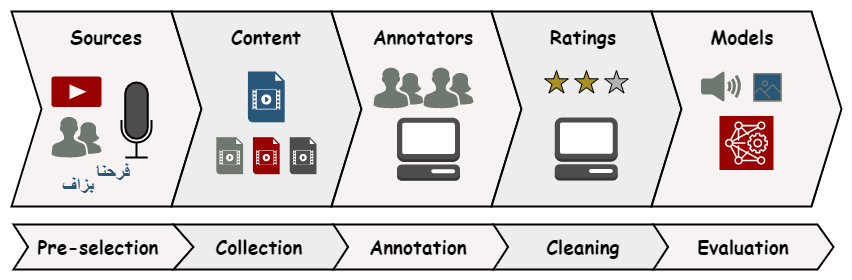

# MORAD: A Multimodal Dataset of Authentic Emotional Expressions in Moroccan Arabic

This repository hosts the code for evaluating models on MORAD, a multimodal dataset that captures authentic emotional expressions in the Moroccan Arabic dialect.

------------

## MORAD corpus
MORAD is a multimodal dataset created to support emotion recognition research in the Moroccan Arabic Dialect (Darija). The dataset includes:

    - 2200 videos totaling 3 hours of content.
    - 254 unique speakers expressing emotions in unscripted, natural settings.
    - Four emotions: happiness(14.3%), sadness(16.1%), anger(23.3%), and neutrality(46.3%).

Various deep learning models were evaluated on MORAD, including unimodal (speech, visual, and text) and multimodal approaches. The highest performance was achieved by the multimodal model with a weighted F1 score of **73.11%** and an accuracy of **73.36%**.



*Figure: Overview of the MORAD dataset collection pipeline.*


*Figure: Word cloud representation of the filtered most comon words in MORAD*


## Evaluation Results
We benchmarked several emotion recognition methodologies on the MORAD dataset, covering different data modalities:

### Speech Models
| Model                                     | WF1       | Acc.  |
|-------------------------------------------|-----------|-------|
| [MF-LSTM](./models/audio/mflstm.py)       | 52.43     | 56.66 |
| [MS-CNN](./models/audio/mscnn.py)         | 46.75     | 52.14 |
| [Wav2vec 2.0](./models/audio/wav2vec2.py) | 55.60     | 59.14 |
| [Hubert](./models/audio/hubert.py)        | 57.12     | 62.30 |
| [Whisper](./models/audio/whisper.py)      | <u>**69.51**</u> | <u>**71.33**</u> |

### Visual Models
| Model                                         | WF1   | Acc.  |
|-----------------------------------------------|-------|-------|
| [CNN-T](./models/vision/resnet.py)            | 45.09 | 53.50 |
| [MAE-T](./models/vision/mae.py)               | 46.44 | 48.76 |
| [CLIP-T](./models/vision/clip.py)             | 66.31 | <u>**66.82**</u> |
| [VideoMAE](./models/vision/videomae.py)       | 53.76 | 53.72 |
| [VideoSwin](./models/vision/videoswin.py)     | 58.99 | 59.37 |
| [TimeSformer](./models/vision/timesformer.py) | <u>**66.38**</u> | 66.59 |
| [Vivit](./models/vision/vivit.py)             | 50.11 | 50.56 |


### Textual Models
| Model                                            | WF1   | Acc.  |
|--------------------------------------------------|-------|-------|
| [MARBERTv2](./models/text/bert.py)               | <u>**53.14**</u> | <u>**55.08**</u> |
| [CAMeLBERT-DA SA](./models/text/bert.py)         | 46.96 | 52.37 |
| [XLM-RoBERTa](./models/text/bert.py)             | 42.50 | 48.08 |
| [Dialectal Arabic XLM-R](./models/text/bert.py)  | 51.36 | 53.05 |

### Multimodal Models
| Model                                         | WF1   | Acc.  |
|-----------------------------------------------|-------|-------|
| [A+T](./models/multi/cliper_at.py)            | 66.76 | 68.40 |
| [V+T](./models/multi/cliper_vt.py)            | 63.31 | 64.56 |
| [A+V+T](./models/multi/cliper_avt.py)         | 69.43 | 70.65 |
| [*CLIPER* (A+V)](./models/multi/cliper_av.py) | <u>**73.11**</u> | <u>**73.36**</u> |

## Environmet
- **Python Version**: 3.11.
- **PyTorch Version**: 2.2.2
- **Transformers Version**: 4.42.3
- **CUDA Version**: 12.1
- **GPU**: Nvidia A100 - 80GB


## Usage
### Training
```bash
python main.py -c path/to/config.yaml -m model_name -d device
```

- `-c` or `--config_path`: **Required**. The path to the configuration file.
- `-m` or `--model`: **Required**. The name of the model to be used, which should correspond to a module in the `engines` directory.
- `-d` or `--device`: Specifies the device for training. This can be:
  - `cpu`: Use the CPU.
  - A single integer (e.g., `0`): Use a specific GPU.
  - A comma-separated list of integers (e.g., `0,1`): Use multiple GPUs.
  - **Default**: `cpu`


### Testing
```bash
python test.py -m model_name -p path/to/models_dir -v version_number -d device
```
- `-m` or `--model`: **Required**. The name of the model to be used for testing.
- `-p` or `--path`: The path to the directory where the model weights are stored.
- `-v` or `--version`: **Required**. The version of the model to be tested.
- `-d` or `--device`: Specifies the device for testing.


## CITATION
    @citation{TODO}


